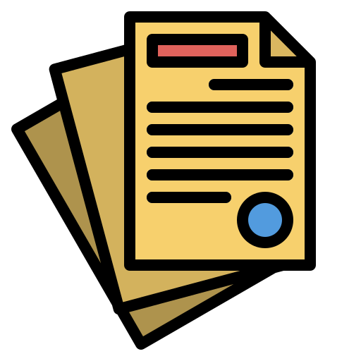

<!-- Improved compatibility of back to top link: See: https://github.com/othneildrew/Best-README-Template/pull/73 -->


<a id="readme-top"></a>
<!-- PROJECT LOGO -->
<br />
<div align="center">
  <a href="https://github.com/your_username/document-formatter">
    
  </a>

<h3 align="center">Document Formatter on Agent System</h3>

  <p align="center">
    An intelligent document processing system that uses IndexRAG to validate and format documents based on custom instructions.
    <br />
    <a href="https://github.com/N0maD/document-formatter"><strong>Explore the docs »</strong></a>
    <br />
    <br />
    ·
    <a href="https://github.com/N0maD/document-formatter/issues">Report Bug</a>
    ·
    <a href="https://github.com/N0maD/document-formatter/issues">Request Feature</a>
  </p>
</div>

<!-- TABLE OF CONTENTS -->
<details>
  <summary>Table of Contents</summary>
  <ol>
    <li>
      <a href="#about-the-project">About The Project</a>
    </li>
    <li>
      <a href="#getting-started">Getting Started</a>
      <ul>
        <li><a href="#prerequisites">Prerequisites</a></li>
        <li><a href="#installation">Installation</a></li>
      </ul>
    </li>
    <li><a href="#usage">Usage</a></li>
    <li><a href="#roadmap">Roadmap</a></li>
    <li><a href="#contributing">Contributing</a></li>
    <li><a href="#contact">Contact</a></li>
    <li><a href="#acknowledgments">Acknowledgments</a></li>
  </ol>
</details>

<!-- ABOUT THE PROJECT -->
## About The Project

This project is an intelligent agent system designed to automate the processing and validation of formal documents. Unlike simple rule-based checkers, this system utilizes a [IndexRAG](https://arxiv.org/abs/2603.16415) architecture.

It parses instruction documents (guidelines, GOST standards, etc.), constructs a Knowledge Graph to understand relationships between sections and rules, and indexes content into a Vector Database for semantic search. Users can then query the system to check if their documents meet specific requirements.

**Key Features:**
*   **IndexRAG**: using idea from this paper[].
*   **LLM Powered**: Uses Mistral AI(or Qwen2.5 for local mode) for entity extraction, embedding generation, and answer synthesis.
*   **Format Support**: DOCX is a main format.
*   **Interactive UI**: Built-in FastAPI backend with a responsive HTML/JS frontend for real-time chat and processing.

<p align="right">(<a href="#readme-top">back to top</a>)</p>

### Built With

This section should list any major frameworks/libraries used to bootstrap your project.

*   FastAPI
*   Mistral
*   ChromaDB
*   LlamaIndex
*   Docker

<p align="right">(<a href="#readme-top">back to top</a>)</p>

<!-- GETTING STARTED -->
## Getting Started

To get a local copy up and running follow these simple steps.

### Prerequisites

You need to have Docker and Docker Compose installed to run the application easily.
*   **Mistral API Key**: Get your key from [Mistral AI Console](https://console.mistral.ai/)

### Installation

1.  Clone the repo
    ```sh
    git clone https://github.com/art-kors/document-formatter.git
    cd document-formatter
    ```
2.  Create an environment file
    Create a file named `.env` in the root directory and add your Mistral API Key:
    ```env
    MISTRAL_API_KEY=your_api_key_here
    ```
    *(Important: Do not wrap the key in quotes).*

3.  Build and Run with Docker
    ```sh
    docker compose up --build
    ```
4.  Open your browser
    Navigate to `http://127.0.0.1:8000`

<p align="right">(<a href="#readme-top">back to top</a>)</p>

<!-- USAGE EXAMPLES -->
## Usage

The workflow consists of two main stages: **Indexing** and **Querying**.

1.  **Upload Files**:
    *   Select your **Document** (the work you want to check, e.g., a thesis draft).
    *   Select your **Instruction** (the rule set).
    *   Click **"Генерировать"** (Generate).

2.  **Chat with the System**:
    *   Once processing is complete, the report interface will appear.
    *   Check traceback with explanations.
    *   The system retrieves relevant rules from the graph and generates a precise answer.


<p align="right">(<a href="#readme-top">back to top</a>)</p>

<!-- ROADMAP -->
## Roadmap

- [x] Basic RAG Pipeline with Mistral AI
- [x] Knowledge Graph Integration (NetworkX)
- [x] UI for File Upload and Chat
- [x] Add support for image-based docs
- [ ] User authentication and history saving
- [ ] Export validation report to PDF
- [x] Structure Agent
- [x] Logic Agent 
- [x] auto-apply changes

<p align="right">(<a href="#readme-top">back to top</a>)</p>

<!-- CONTRIBUTING -->
## Contributing

Contributions are what make the open source community such an amazing place to learn, inspire, and create. Any contributions you make are **greatly appreciated**.

If you have a suggestion that would make this better, please fork the repo and create a pull request.

1.  Fork the Project
2.  Create your Feature Branch (`git checkout -b feature/AmazingFeature`)
3.  Commit your Changes (`git commit -m 'Add some AmazingFeature'`)
4.  Push to the Branch (`git push origin feature/AmazingFeature`)
5.  Open a Pull Request

<p align="right">(<a href="#readme-top">back to top</a>)</p>

<!-- CONTACT -->
## Contact

Artemii Korsaev - [@AK_N0maD](https://t.me/AK_N0maD) - art.kors@yandex.ru

Project Link: [Document Formatter](https://github.com/art-kors/document-formatter)

<p align="right">(<a href="#readme-top">back to top</a>)</p>

<!-- ACKNOWLEDGMENTS -->
## Acknowledgments

*   [Deep Learning School](https://dls.samcs.ru/)
*   [Artem Katsnelson](https://www.hse.ru/staff/akatsnelson/)
*   Alexander Gavrilov
*   [Zhenghua Bao](https://www.semanticscholar.org/author/Zhenghua-Bao/2405433579)
*   [Yi Shi](https://www.semanticscholar.org/author/Yidong-Shi/2204885006)

<p align="right">(<a href="#readme-top">back to top</a>)</p>

<!-- MARKDOWN LINKS & IMAGES -->
<!-- https://www.markdownguide.org/basic-syntax/#reference-style-links -->
[product-screenshot]: images/screenshot.png
[FastAPI]: https://img.shields.io/badge/FastAPI-009688?style=for-the-badge&logo=fastapi&logoColor=white
[FastAPI-url]: https://fastapi.tiangolo.com/
[Python]: https://img.shields.io/badge/Python-3776AB?style=for-the-badge&logo=python&logoColor=white
[Python-url]: https://www.python.org/
[Mistral]: https://img.shields.io/badge/Mistral_AI-FF7000?style=for-the-badge&logo=mistral&logoColor=white
[Mistral-url]: https://mistral.ai/
[ChromaDB]: https://img.shields.io/badge/ChromaDB-FF6F00?style=for-the-badge&logo=chromadb&logoColor=white
[ChromaDB-url]: https://www.trychroma.com/
[LlamaIndex]: https://img.shields.io/badge/LlamaIndex-00BFFF?style=for-the-badge&logo=llamaindex&logoColor=white
[LlamaIndex-url]: https://www.llamaindex.ai/
[Docker]: https://img.shields.io/badge/Docker-2496ED?style=for-the-badge&logo=docker&logoColor=white
[Docker-url]: https://www.docker.com/
